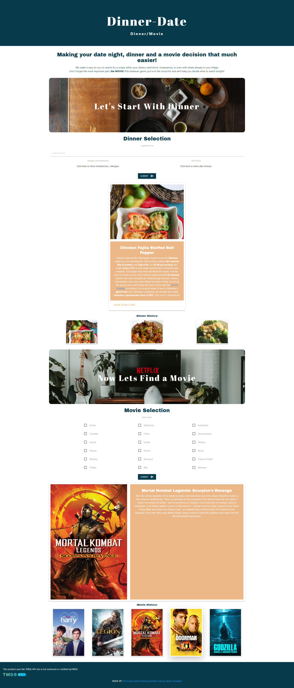

# Dinner-date

## DESCRIPTION

An application to help plan your evening with dinner and a movie!

check out the deployed project here! [here](https://thetiiiim.github.io/evening-planner/)


## Screenshot of Application




## Directions 
```
- Input ingredients available, allergies, or diet preference and hit the search button to
get a random dinner idea! link to recipe page is available with the displayed card.
- Next pick what movie genre you desire and hit search for a random movie selection!
- your 6 most recent dinner and movie searches will be saved and when clicked will display the original information!
```

## User Story

```
AS an indecisive person
I WANT someone to recommend ideas for dinner and a movie
SO THAT the decision is taken care of
```

## Acceptance Criteria

```
GIVEN a portal to recommend a movie and a meal
WHEN I specify dietary and ingredient restrictions
THEN I am present with options for a meal
WHEN I specify genres or movie details
THEN I am presented with a movie to watch
```

## Usage

 - JavaScript
 - HTML
 - CSS
 - Materialize
 - JQuery
  [TheMovieDB API](https://www.themoviedb.org/documentation/api)
  [Spoonacular API](https://spoonacular.com/food-api)

## TEAM ROLES

### UI

* [Tim](https://github.com/TheTiiiim): Forms/functionality
* [Taylor](https://github.com/Taylorgonz): Design/layout

### API

* [Hannah](https://github.com/hannamunoz): Recipe API/backend functions
* [Brendan](https://github.com/SprengerV): Movie API/ bakend functions

## licensing
https://www.mit.edu/~amini/LICENSE.md

